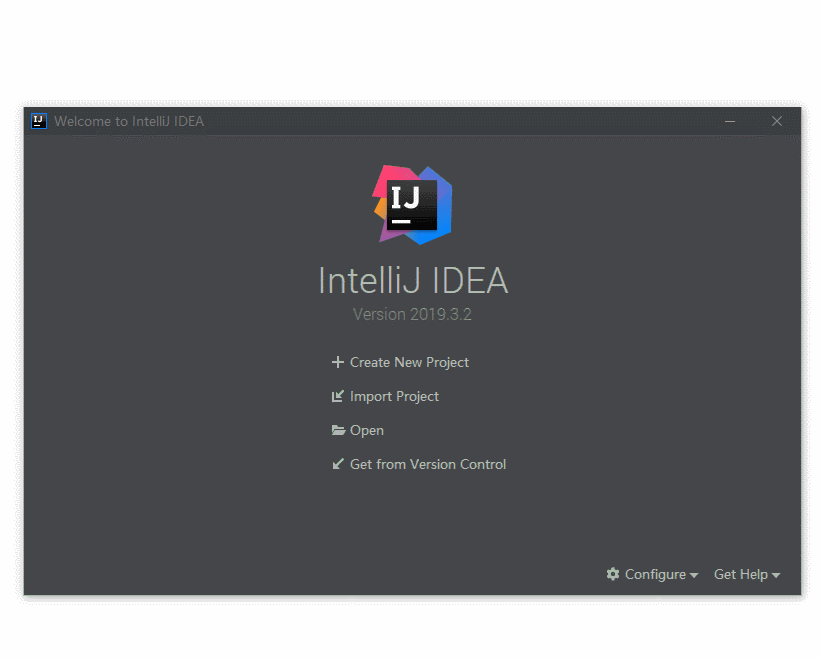
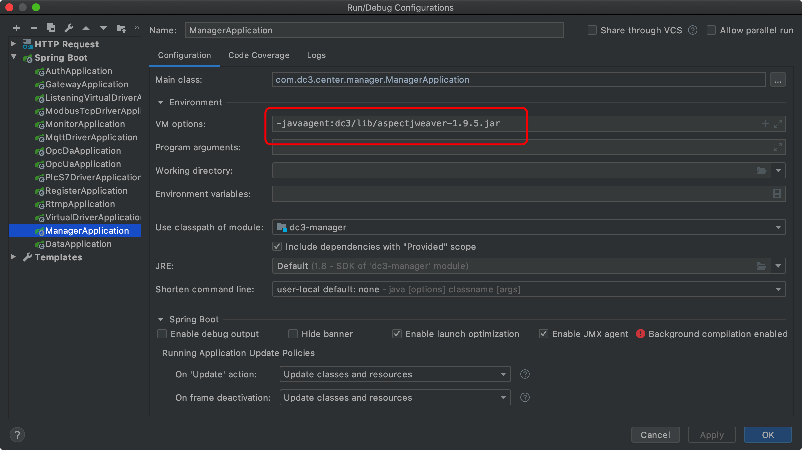

### 必要软件环境

* JDK : `Oracle JDK 1.8` 或者 `OpenJDK8`；

* Maven : 推荐使用 `Maven 3.6` ，理论来说其他版本也行；

* IDE : `IntelliJ IDEA` 或者 `Eclipse`；

* Docker : 需要提供 `docker` 和 `docker-compose` 指令，至少需要给 `docker` 分配 `4G` 的运行内存。

**前提：** 必须保证至少需要给docker分配：2核 CPU 以及 4G 以上的运行内存


### Hosts配置

**说明：** 该步骤仅在本地开发电脑上进行配置，如果部署生产环境无需配置

hosts文件位置：

Windows（需要使用管理员权限）：`c:\windows\system32\drivers\etc\hosts`

Linux：`/etc/hosts`

在 hosts 文件中添加以下内容：

```bash
# Added by DC3
127.0.0.1       dc3.com
127.0.0.1       dc3-mysql
127.0.0.1       dc3-redis
127.0.0.1       dc3-mongo
127.0.0.1       dc3-rabbitmq
127.0.0.1       dc3-register
127.0.0.1       dc3-nginx
# dev
127.0.0.1       dc3-auth
127.0.0.1       dc3-manager
127.0.0.1       dc3-data
# End DC3
```


### 安装 & 启动必要依赖

 **说明：** 该步骤会安装 & 启动依赖服务：

 - 关系型数据库 : `MySQL`
 - 非关系型数据库 : `MongoDB`
 - 内存数据库 : `Redis`
 - 消息中间件 : `RabbitMQ`
 - 服务注册中心 : `Register`
 - 服务监控中心 : `Monitor`
 - 权限管理中心 : `Auth`


```bash
cd iot-dc3
mvn -s dc3/dependencies/maven/settings.xml clean -U package
cd dc3
docker-compose build mysql redis mongo rabbitmq register monitor auth
docker-compose up -d mysql redis mongo rabbitmq register monitor auth
```


### 导入项目到 Idea IDE 中

务必使用Maven方式导入项目

 


### 启动 Manager & Data 服务

在 Idea 中依次启动 `dc3-manager` 、 `dc3-data` 

 Main函数为位置：

 `dc3-manager`：dc3-center/dc3-manager/src/main/java/com/dc3/center/manager/ManagerApplication.java

 `dc3-data`：dc3-center/dc3-data/src/main/java/com/dc3/center/data/DataApplication.java


 注意：在启动 `dc3-manager` 、 `dc3-data` 的时候由于开启了 `ASPECTJ` ，所以需要配置 `-javaagent:dc3/lib/aspectjweaver-1.9.5.jar`




### 启动待开发的 驱动 程序

 根据实际情况，启动 、开发 驱动程序

 位置：dc3-driver/

 目前已支持的驱动，需要根据实际项目情况，适当微调，也可以仿照现有的驱动开发其他的驱动模块：

 - plcs7
 - socket（client模式、server模式）
 - mqtt
 - opcda
 - opcua
 - modbus-tcp